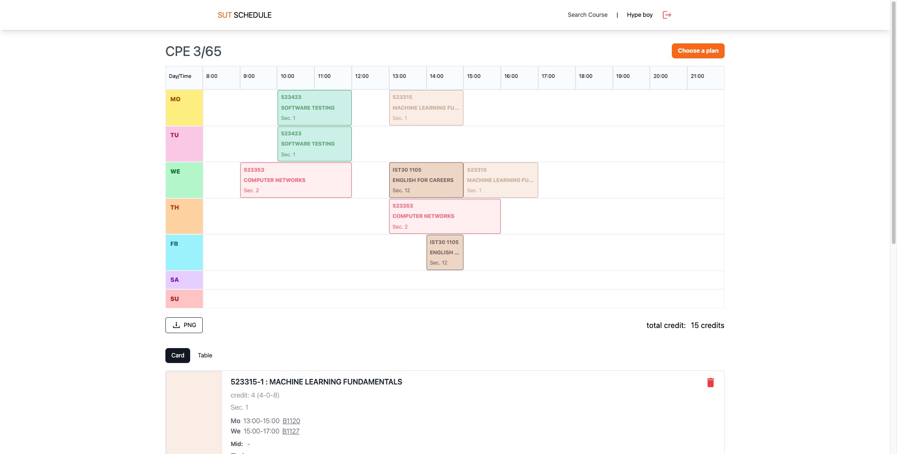

# SUT Schedule

A dope Web App for SUT students to plan their class schedules

## Getting started 🚀

Clone this repository

```zsh
git clone https://github.com/pandakn/sut-schedule.git

cd sut-schedule
```

Install dependencies using `npm`

```zsh
cd client
npm install

cd server
npm install
```

After this step, you will get `node_modules` folder in the root of the project.

### Start Server

```zsh
docker-compose -f docker-compose.yml up
```

### Start Client

```zsh
cd client

npm run dev
```

The backend will run at [localhost:3000](http://localhost:3000) or you can port change

### Connect with redis-cli

```
docker exec -it redis redis-cli
```

# Screenshot 📸



# API

- [Course from SUT Reg](https://github.com/pandakn/sut-schedule/tree/main/server)
